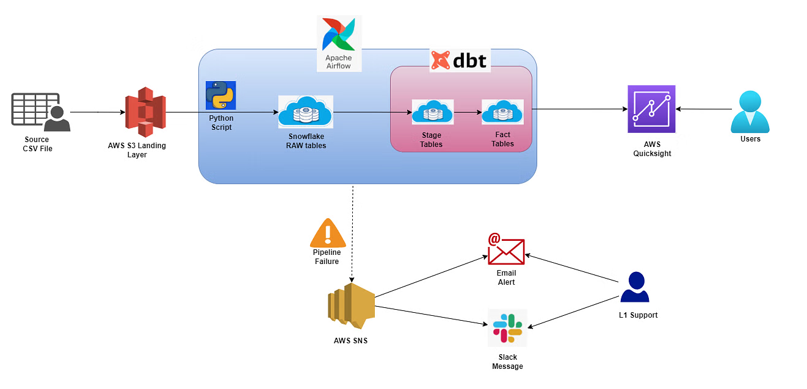

# Healthcare_Analytics

MLOPS project on End-End Healthcare Analytics using Snowflake and AWS - 1
# Aim
1. Data Analysis in Snowflake
2. Build a Machine Learning model to predict the length of stay for patients
3. To schedule the AWS Sagemaker Notebook
4. To perform live data scoring and inserting predictions to Snowflake
5. send status mail
# Data
The training data is present in snowflake for about 230k patients across various regions
and hospitals. There are total 19 features available in the data.
The simulation data is available for 71K patients for prediction purpose.

# Tech Stack
* Tools: AWS Sagemaker, Snowflake
* Language: Python➢ Libraries: snowflake-connector-python, pandas, numpy, scikit-learn